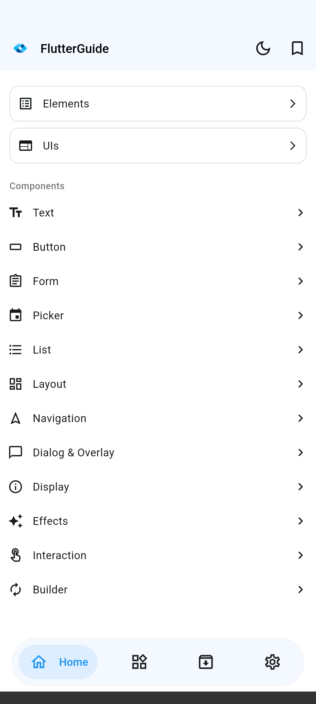
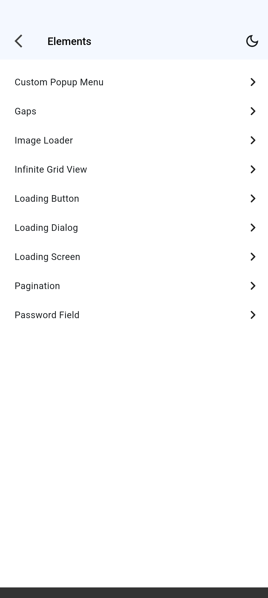
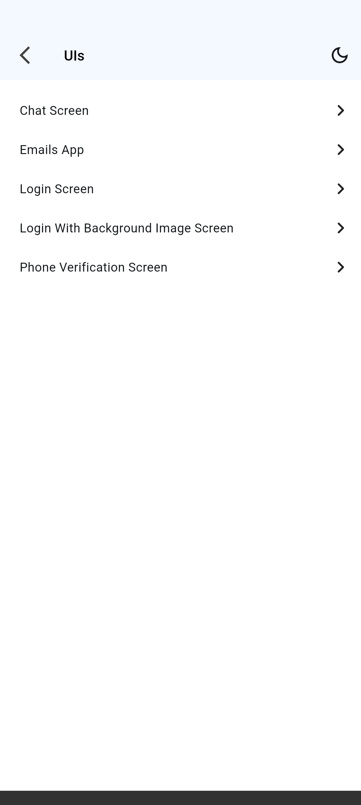
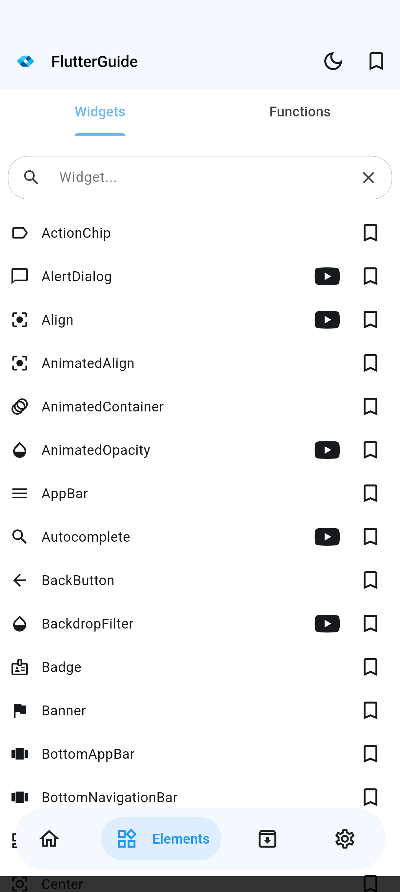
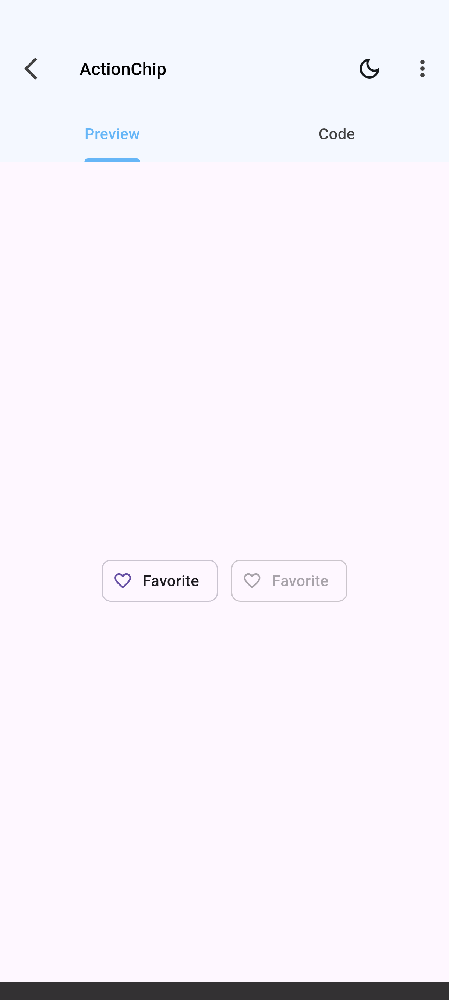
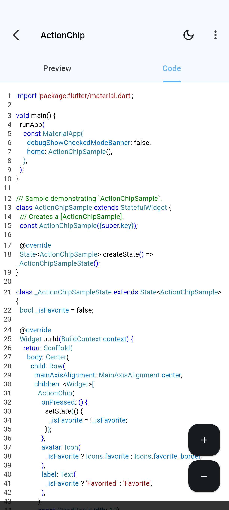
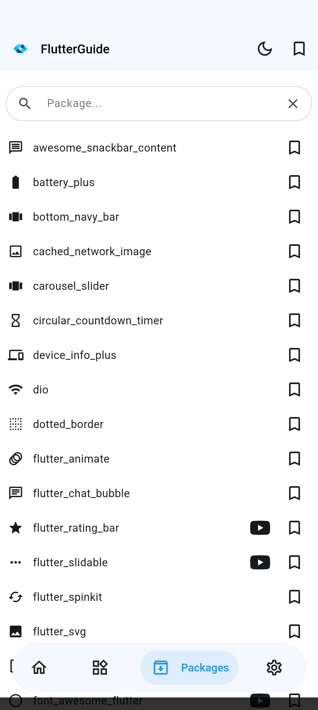
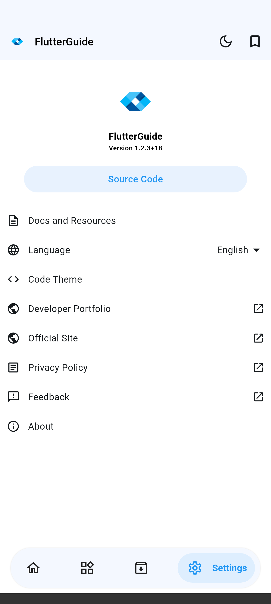
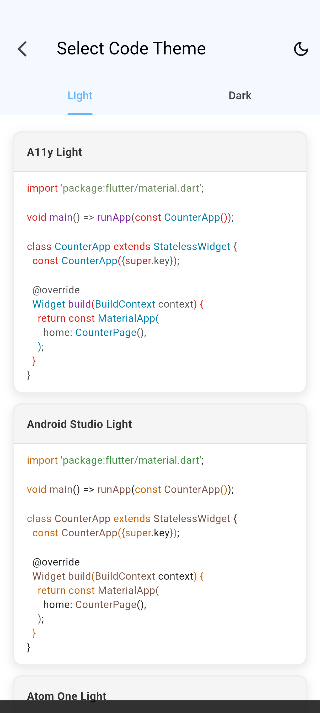

<br>
<div align="center">


</div>
<br>

<p align="center">
<a href="README.md">English</a> · <a href="README.pt-BR.md">Português (BR)</a> · <strong>Español</strong>
</p>

<h1 align="center">FlutterGuide: Aplicación Móvil</h1>

<p align="center">
Una aplicación Android para explorar widgets, funciones y paquetes de Flutter/Dart, cada uno con código ejecutable y una vista previa en vivo.
<br>
<a href="#acerca-del-proyecto"><strong>Explora la documentación »</strong></a>
<br>
<br>
<a href="https://flutterguide.app">Ver Sitio Web</a>
·
<a href="https://github.com/dariomatias-dev/flutter_guide_app/issues">Reportar un Error</a>
·
<a href="https://github.com/dariomatias-dev/flutter_guide_app/issues">Solicitar una Función</a>
</p>

## Tabla de Contenidos

- [Acerca Del Proyecto](#acerca-del-proyecto)
- [Características](#características)
- [Construido Con](#construido-con)
- [Capturas de Pantalla](#capturas-de-pantalla)
- [Descargar la Aplicación](#descargar-la-aplicación)
- [Primeros Pasos](#primeros-pasos)
- [Scripts](#scripts)
- [Contribuir](#contribuir)
- [Licencia](#licencia)
- [Autor](#autor)

## Acerca Del Proyecto

**FlutterGuide** es un catálogo móvil de piezas de Flutter y Dart, creado para ayudar tanto a desarrolladores principiantes como experimentados a aprender mediante ejemplos.

Cada elemento (widget, función o paquete) incluye su código fuente y una vista previa interactiva renderizada dentro de la propia app, para que veas el comportamiento antes de copiarlo a tu proyecto. El catálogo también incluye pantallas de UI ya construidas y elementos de interfaz reutilizables para patrones comunes de aplicaciones.

## Características

- **Catálogo de Widgets, Funciones y Paquetes**: Explora widgets Material y Cupertino, funciones esenciales de Dart y paquetes populares, cada uno con código, vista previa interactiva y enlace a la documentación oficial.
- **Elementos y Ejemplos de UI**: Pantallas de ejemplo completas (inicio de sesión, chat, formularios y más) y elementos de interfaz reutilizables para estudiar o copiar.
- **Favoritos**: Guarda cualquier widget, función o paquete para acceder rápidamente después.
- **Búsqueda**: Filtra cada catálogo por nombre mientras escribes.
- **Deep Linking**: Abre un componente o ejemplo específico directamente desde un enlace compartido.
- **Múltiples Idiomas**: Interfaz completa en inglés, portugués (Brasil) y español.
- **Selector de Tema de Código**: Elige el tema de resaltado de sintaxis usado en los ejemplos de código, con variantes clara y oscura.

## Construido Con

- **[Flutter](https://flutter.dev/)**: Kit de herramientas de UI de Google para construir aplicaciones nativas desde una única base de código.
- **[Dart](https://dart.dev/)**: El lenguaje de programación detrás de Flutter.
- **[Riverpod](https://riverpod.dev/)**: Gestión de estado e inyección de dependencias.
- **[go_router](https://pub.dev/packages/go_router)**: Enrutamiento declarativo y manejo de deep links.
- **[flutter_syntax_highlighter](https://pub.dev/packages/flutter_syntax_highlighter)**: Resaltado de sintaxis para los ejemplos de código.

## Capturas de Pantalla

<div align="center">









</div>

## Descargar la Aplicación

Obtén **FlutterGuide** directamente desde **Google Play Store**:

<a href="https://play.google.com/store/apps/details?id=com.dariomatias.flutter_guide" target="_blank">

</a>

## Primeros Pasos

El proyecto fija la versión del Flutter SDK mediante [FVM](https://fvm.app/), por lo que todos los comandos siguientes usan `fvm flutter` en lugar de un `flutter` instalado directamente.

```sh
git clone https://github.com/dariomatias-dev/flutter_guide_app.git
cd flutter_guide_app
fvm install
fvm flutter pub get
```

Crea un archivo `.env` en la raíz del proyecto (está en `.gitignore`) con las siguientes claves; deja los valores vacíos para ejecutar localmente sin anuncios:

```
DEVICE_ID=
BANNER_AD_ID=
BANNER_AD_SAMPLE_ID=
INTERSTICIAL_AD_SAMPLE_ID=
REWARDED_AD_SAMPLE_ID=
APP_OPEN_AD_SAMPLE_ID=
```

Luego ejecuta la app en un dispositivo o emulador conectado:

```sh
fvm flutter run
```

## Scripts

Los scripts utilitarios están en `scripts/`.

| Script       | Comando                             | Descripción                                                                                                                                                    |
| ------------ | ------------------------------------ | -------------------------------------------------------------------------------------------------------------------------------------------------------------- |
| `screenshot` | `scripts/screenshot.sh [device-id]` | Recorre las pantallas principales de la app en un dispositivo o emulador conectado y guarda una captura de cada una en `screenshots/`, usadas en este README, en la Play Store y en el sitio oficial. Ejecuta `fvm flutter devices` para listar los ids de dispositivos disponibles. |

## Contribuir

Las contribuciones hacen que la comunidad de código abierto sea un lugar increíble para aprender y crear. Cualquier contribución que hagas será muy apreciada.

Antes de abrir un pull request, consulta [CONTRIBUTING.md](CONTRIBUTING.md) (en inglés) para la configuración local, la convención de mensajes de commit (Conventional Commits) y las reglas de ramas de este proyecto.

## Licencia

Distribuido bajo la **Licencia MIT**. Consulta el archivo [LICENSE](LICENSE) para más información.

## Autor

Desarrollado por **Dário Matias Sales**:

- **Portafolio**: [dariomatias-dev](https://dariomatias-dev.com)
- **GitHub**: [dariomatias-dev](https://github.com/dariomatias-dev)
- **Email**: [dariomatias.dev@gmail.com](mailto:dariomatias.dev@gmail.com)
- **Instagram**: [@dariomatias_dev](https://instagram.com/dariomatias_dev)
- **LinkedIn**: [linkedin.com/in/dariomatias-dev](https://linkedin.com/in/dariomatias-dev)
