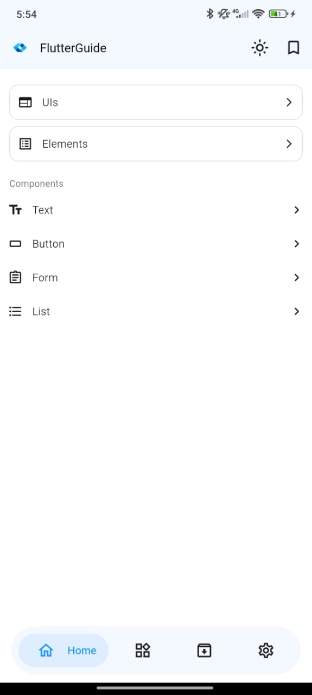
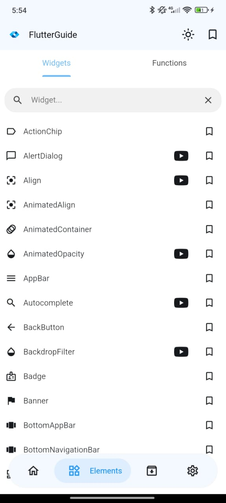
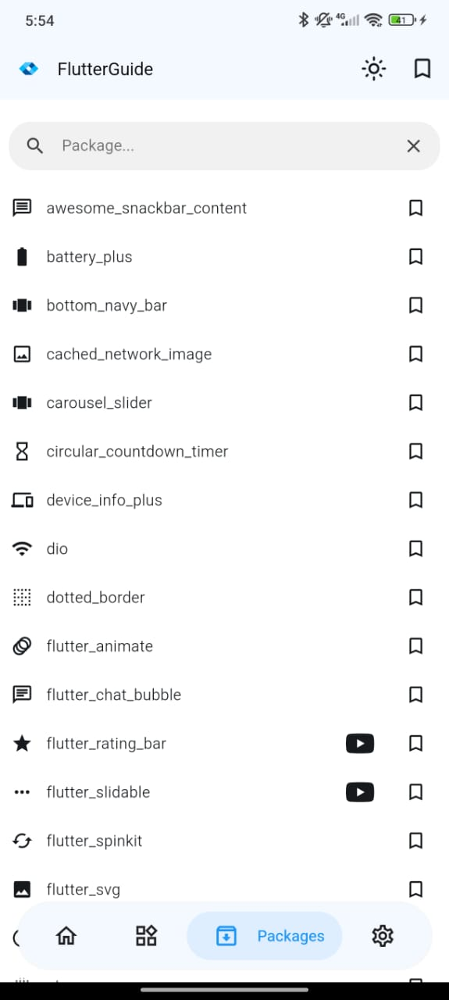
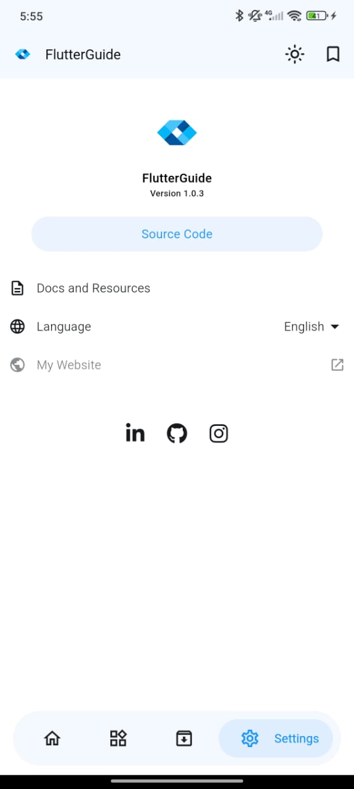
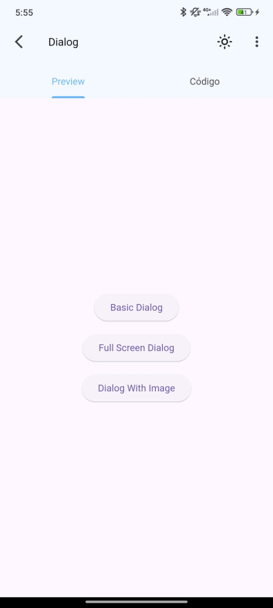
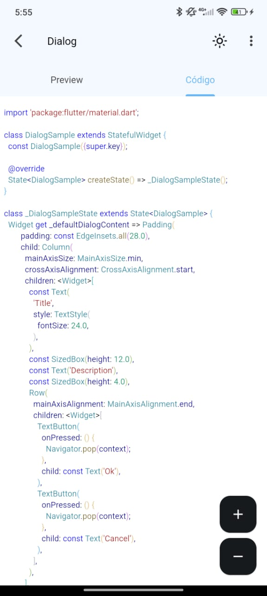

<br>
<div align="center">


</div>
<br>

<h1 align="center">Flutter Guide – Mobile App</h1>

<p align="center">
A mobile app designed to help developers learn, practice, and master Flutter through curated content.
<br>
<a href="#about-the-project"><strong>Explore the docs »</strong></a>
<br>
<br>
<a href="https://flutterguide.app">View Website</a>
·
<a href="https://github.com/dariomatias-dev/flutter_guide_app/issues">Report Bug</a>
·
<a href="https://github.com/dariomatias-dev/flutter_guide_app/issues">Request Feature</a>
</p>

## Table of Contents

- [About The Project](#about-the-project)
- [Features](#features)
- [Built With](#built-with)
- [Screenshots](#screenshots)
- [Downloads](#downloads)
- [Contributing](#contributing)
- [License](#license)
- [Contact](#contact)

## About The Project

**Flutter Guide** is a mobile app developed to accelerate the learning curve for both beginner and experienced Flutter developers.
It offers a variety of code examples for widgets, functions, packages, as well as elements and interfaces built with this technology.

The app itself showcases Flutter’s features, demonstrating how a single codebase can deliver responsive interfaces, smooth animations, and optimized performance on both Android and iOS.

## Features

- **Responsive Design**: Fully adaptive UI that delivers a seamless experience across different screen sizes.
- **Smooth Animations**: Fluid, high-performance animations that enhance user experience without sacrificing speed.
- **Optimized Performance**: Built with efficiency in mind to ensure fast and reliable app behavior.
- **API Integration**: Seamless connectivity with external APIs for dynamic and up-to-date content.
- **Real Examples**: Access real code examples to boost productivity.

## Built With

This project was developed using the following core technologies:

- **[Flutter](https://flutter.dev/)** – A UI toolkit by Google for building beautiful, natively compiled applications for mobile, web, and desktop from a single codebase.
- **[Dart](https://dart.dev/)** – The programming language used for Flutter, optimized for building fast apps on any platform.

## Screenshots

<div align="center">






</div>

## Downloads

Get **Flutter Guide** directly from the **Google Play Store**:

<a href="https://play.google.com/store/apps/details?id=com.dariomatias.flutter_guide" target="_blank">

</a>

## Contributing

Contributions make the open-source community an amazing place to learn and create. Any contributions you make are greatly appreciated.

To get started:

1. **Fork the Project**
2. **Create your Feature Branch**

   ```sh
   git checkout -b feature/AmazingFeature
   ```

3. **Commit your Changes**

   ```sh
   git commit -m 'Add some AmazingFeature'
   ```

4. **Push to the Branch**

   ```sh
   git push origin feature/AmazingFeature
   ```

5. **Open a Pull Request**

## License

Distributed under the **MIT License**. See the [LICENSE](LICENSE) file for more information.

## Contact

I am always open to discussing new projects and ideas. Feel free to get in touch.

- **Portfolio**: [dariomatias-dev](https://dariomatias-dev.com)
- **Email**: [matiasdario75@gmail.com](mailto:matiasdario75@gmail.com)
- **Instagram**: [@dariomatias_dev](https://instagram.com/dariomatias_dev)
- **LinkedIn**: [linkedin.com/in/dariomatias-dev](https://linkedin.com/in/dariomatias-dev)
