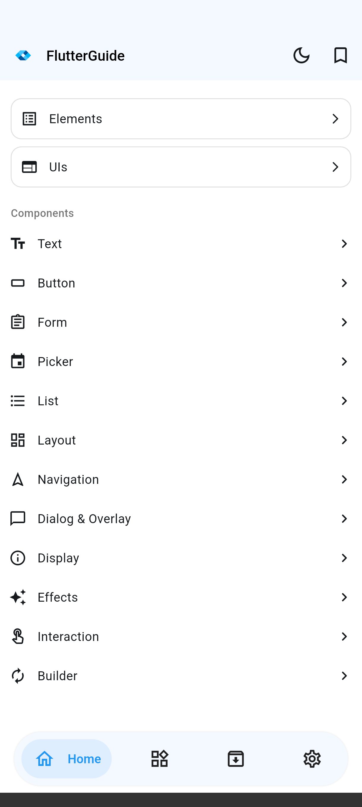
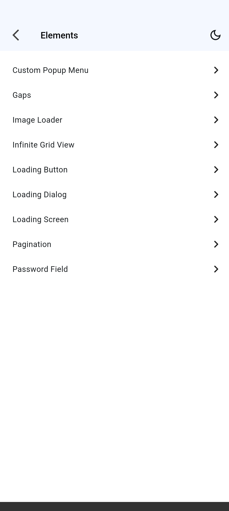
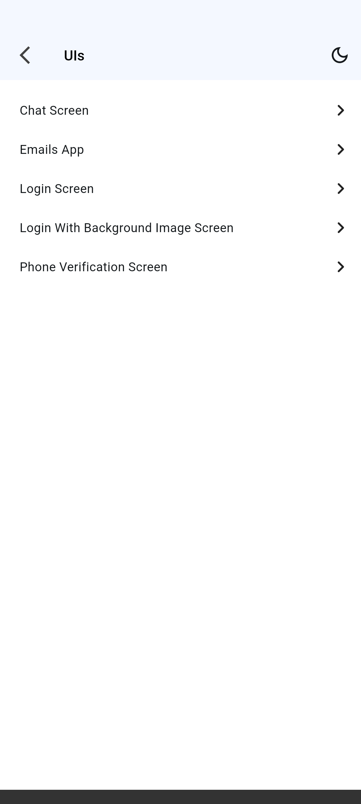
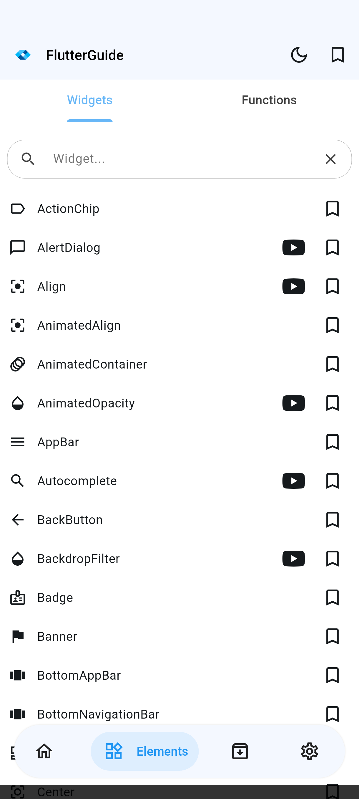
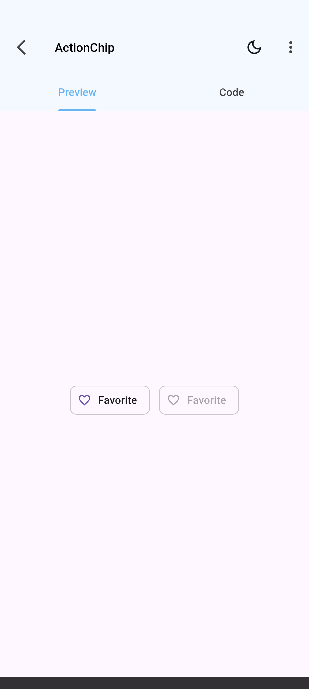
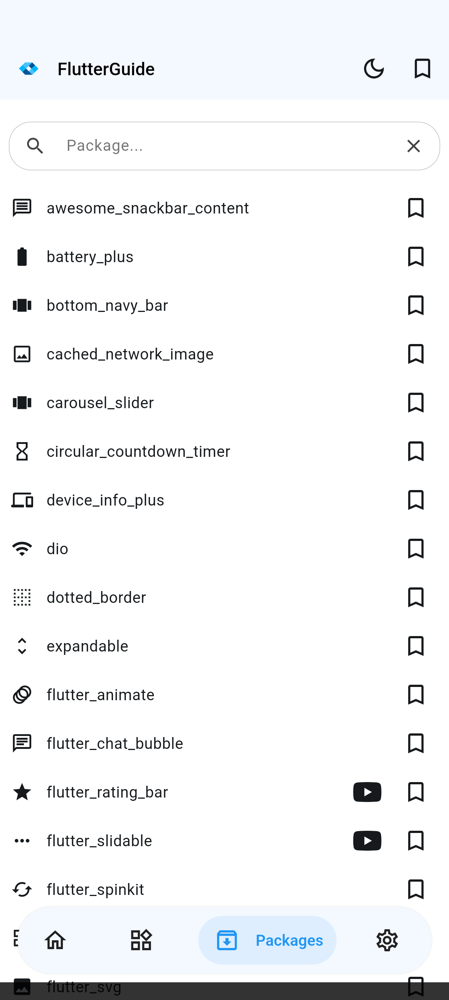
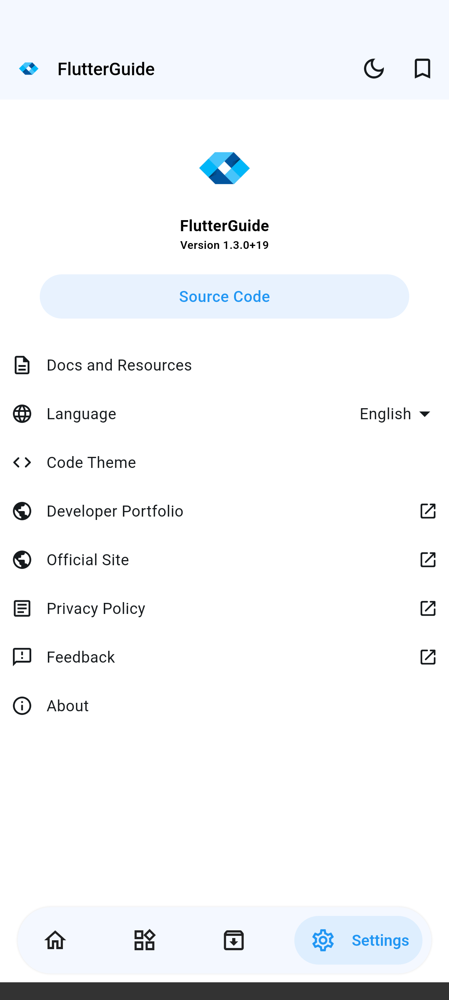
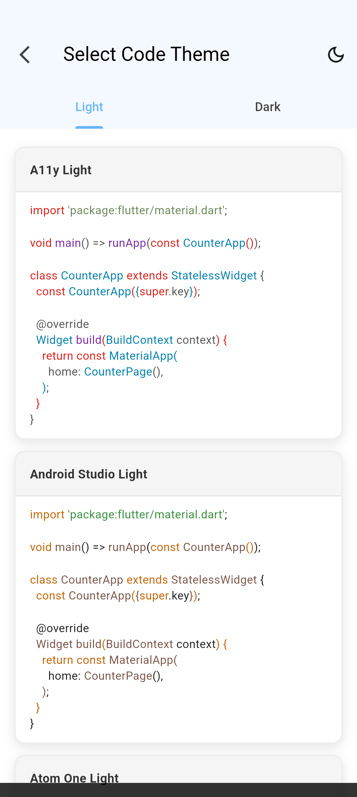

<br>
<div align="center">


</div>
<br>
<div align="center">
<a href="https://github.com/dariomatias-dev/flutter_guide_app/actions/workflows/ci.yaml"></a>

<a href="LICENSE"></a>
</div>
<br>

<p align="center">
<strong>English</strong> · <a href="README.es.md">Español</a> · <a href="README.pt-BR.md">Português (BR)</a>
</p>

<h1 align="center">FlutterGuide: Mobile App</h1>

<p align="center">
An Android app for browsing Flutter/Dart widgets, functions, and packages, each with runnable code and a live preview.
<br>
<a href="#about-the-project"><strong>Explore the docs »</strong></a>
<br>
<br>
<a href="https://flutterguide.app">View Website</a>
·
<a href="https://github.com/dariomatias-dev/flutter_guide_app/issues">Report Bug</a>
·
<a href="https://github.com/dariomatias-dev/flutter_guide_app/issues">Request Feature</a>
</p>

## Table of Contents

- [About The Project](#about-the-project)
- [Features](#features)
- [Built With](#built-with)
- [Architecture](#architecture)
- [Testing](#testing)
- [Screenshots](#screenshots)
- [Download the App](#download-the-app)
- [Getting Started](#getting-started)
- [Scripts](#scripts)
- [Contributing](#contributing)
- [Changelog](#changelog)
- [License](#license)
- [Author](#author)

## About The Project

**FlutterGuide** is a mobile catalog of Flutter and Dart building blocks, built to help both beginner and experienced developers learn by example.

Each entry (widget, function, or package) ships with its source code and a live, interactive preview rendered right in the app, so you can see the behavior before copying it into your own project. The catalog also includes ready-made UI screens and reusable interface elements for common app patterns.

The catalog currently covers:

| Category  | Count |
| --------- | ----- |
| Widgets   | 131   |
| Packages  | 42    |
| Functions | 13    |
| Elements  | 10    |
| UI samples | 6    |
| **Total** | **202** |

## Features

- **Widget, Function & Package Catalog**: Browse Material and Cupertino widgets, core Dart functions, and popular packages, each with code, an interactive preview, and a link to the official docs.
- **Elements & UI Samples**: Full sample screens (login, chat, email client, and more) and reusable interface elements you can study or copy.
- **Favorites**: Save any widget, function, or package for quick access later.
- **Search**: Filter each catalog by name as you type.
- **Deep Linking**: Open a specific component or sample directly from a shared link.
- **Multiple Languages**: Full app UI in English, Portuguese (Brazil), and Spanish.
- **Code Theme Selector**: Pick the syntax-highlighting theme used for code samples, with light and dark variants.
- **Light & Dark Theme**: App-wide theming with a persisted preference.
- **Accessibility**: Semantic labels on interactive elements for screen readers.

## Built With

- **[Flutter](https://flutter.dev/)**: Google's UI toolkit for building natively compiled applications from a single codebase.
- **[Dart](https://dart.dev/)**: The programming language behind Flutter.
- **[Riverpod](https://riverpod.dev/)**: State management and dependency injection.
- **[go_router](https://pub.dev/packages/go_router)**: Declarative routing and deep link handling.
- **[flutter_syntax_highlighter](https://pub.dev/packages/flutter_syntax_highlighter)**: Syntax highlighting for the code samples.
- **[shared_preferences](https://pub.dev/packages/shared_preferences)**: Persisting theme, language, and code theme selections.
- **[google_mobile_ads](https://pub.dev/packages/google_mobile_ads)**: Ad monetization.
- **[app_links](https://pub.dev/packages/app_links)**: Deep link handling.
- **[intl](https://pub.dev/packages/intl)** and Flutter's built-in `l10n` tooling: English, Portuguese (BR), and Spanish localization.
- **[mocktail](https://pub.dev/packages/mocktail)**: Mocking in the test suite.

The in-app catalog also demonstrates dozens more packages, such as `dio`,
`http`, `cached_network_image`, `flutter_svg`, `video_player`,
`flutter_animate`, `photo_view`, and `shimmer`; open the Packages tab in
the app for the full, runnable list.

## Architecture

The app is organized by feature (`lib/src/features/`), each with its own
`data`, `domain`, and `presentation` layers:

- **catalog**: the widget/function/package/element/UI catalog, search, and favorites.
- **home**: the landing screen and component groups.
- **settings**: language selection and app info.
- **code_theme_selector**: the code sample syntax-highlighting theme picker.

State is managed with Riverpod (`ViewModel`/`Notifier` classes exposed
through providers), routing with `go_router`, and persistence through a
`SharedPreferences`-backed service layer. Shared, feature-agnostic widgets
live under `lib/src/shared`; cross-cutting concerns (DI, routing, theming)
live under `lib/src/core`.

## Testing

The project has 37 test files covering repositories, view models,
notifiers, deep link handling, and shared widgets, using `mocktail` for
mocking and `ProviderContainer` overrides for Riverpod state. Code is
linted against the strict `very_good_analysis` rule set, enforced in CI
alongside `dart format` and `flutter test`.

```sh
fvm flutter analyze
fvm flutter test
```

## Screenshots

<div align="center">









</div>

## Download the App

Get **FlutterGuide** directly from the **Google Play Store**:

<a href="https://play.google.com/store/apps/details?id=com.dariomatias.flutter_guide" target="_blank">

</a>

## Getting Started

The project pins its Flutter SDK version via [FVM](https://fvm.app/), so all commands below use `fvm flutter` rather than a bare `flutter` install.

```sh
git clone https://github.com/dariomatias-dev/flutter_guide_app.git
cd flutter_guide_app
fvm install
fvm flutter pub get
```

Create a `.env` file in the project root (it's git-ignored) with the following keys; leave values empty for a local run without ads:

```
DEVICE_ID=
BANNER_AD_ID=
BANNER_AD_SAMPLE_ID=
INTERSTICIAL_AD_SAMPLE_ID=
REWARDED_AD_SAMPLE_ID=
APP_OPEN_AD_SAMPLE_ID=
```

Then run the app on a connected device or emulator:

```sh
fvm flutter run
```

## Scripts

Utility scripts live under `scripts/`.

| Script       | Command                             | Description                                                                                                                                                    |
| ------------ | ------------------------------------ | -------------------------------------------------------------------------------------------------------------------------------------------------------------- |
| `screenshot` | `scripts/screenshot.sh [device-id]` | Drives the app through its main screens on a connected device or emulator and saves a screenshot of each one into `screenshots/`, used for the README, Play Store listing, and official website. Run `fvm flutter devices` to list available device ids. |

## Contributing

Contributions make the open-source community an amazing place to learn and create. Any contributions you make are greatly appreciated.

Before opening a pull request, see [CONTRIBUTING.md](CONTRIBUTING.md) for the local setup, commit message convention (Conventional Commits), and branching rules this project follows.

## Changelog

All notable changes are documented in [CHANGELOG.md](CHANGELOG.md), following the [Keep a Changelog](https://keepachangelog.com) format.

## License

Distributed under the **MIT License**. See the [LICENSE](LICENSE) file for more information.

## Author

Developed by **Dário Matias Sales**:

- **Portfolio**: [dariomatias-dev](https://dariomatias-dev.com)
- **GitHub**: [dariomatias-dev](https://github.com/dariomatias-dev)
- **Email**: [dariomatias.dev@gmail.com](mailto:dariomatias.dev@gmail.com)
- **Instagram**: [@dariomatias_dev](https://instagram.com/dariomatias_dev)
- **LinkedIn**: [linkedin.com/in/dariomatias-dev](https://linkedin.com/in/dariomatias-dev)
