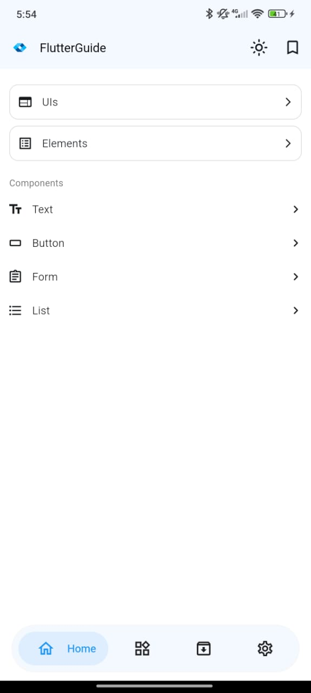
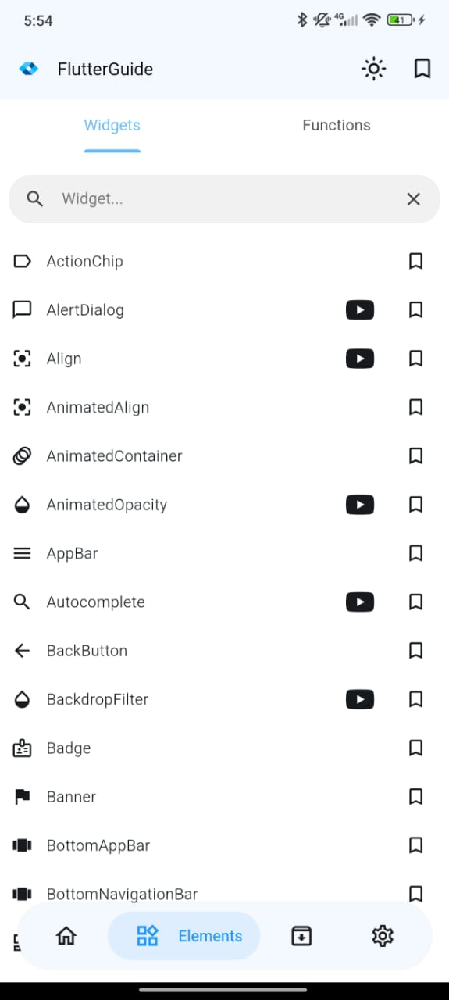
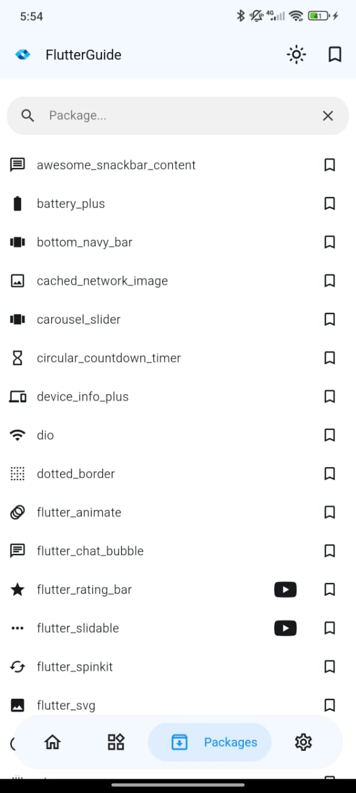
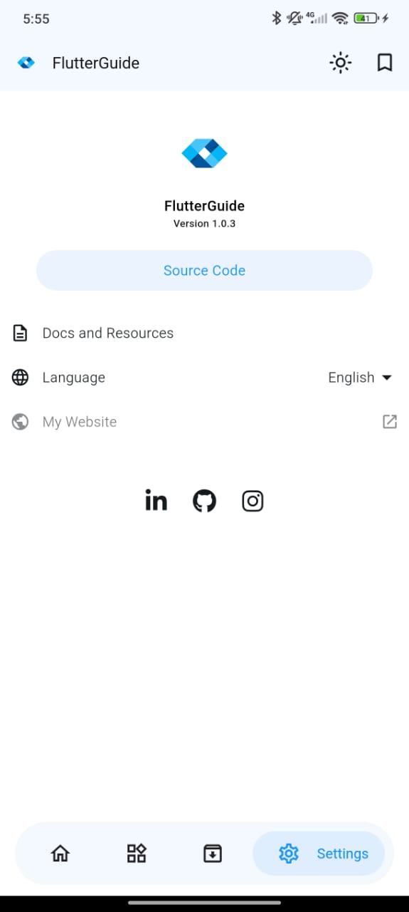
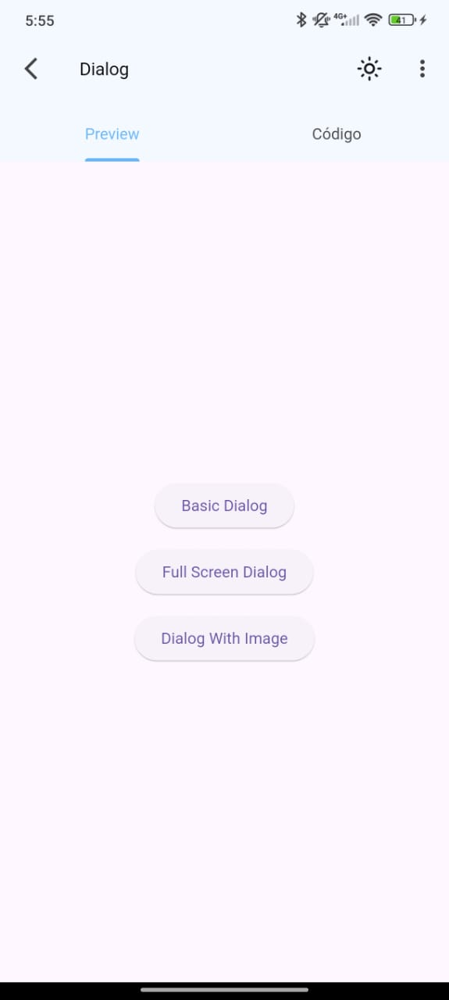
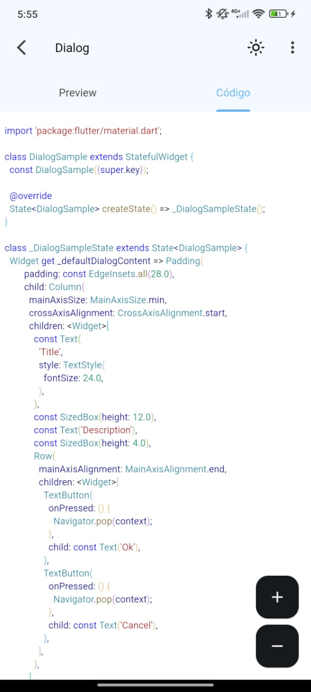

<br>
<div align="center">


</div>
<br>

<p align="center">
<a href="README.md">English</a> · <strong>Português (BR)</strong> · <a href="README.es.md">Español</a>
</p>

<h1 align="center">FlutterGuide – Aplicativo Mobile</h1>

<p align="center">
Um aplicativo mobile projetado para ajudar desenvolvedores a aprender, praticar e dominar Flutter por meio de conteúdo selecionado.
<br>
<a href="#sobre-o-projeto"><strong>Explore a documentação »</strong></a>
<br>
<br>
<a href="https://flutterguide.app">Ver Site</a>
·
<a href="https://github.com/dariomatias-dev/flutter_guide_app/issues">Reportar Bug</a>
·
<a href="https://github.com/dariomatias-dev/flutter_guide_app/issues">Solicitar Funcionalidade</a>
</p>

## Sumário

- [Sobre O Projeto](#sobre-o-projeto)
- [Funcionalidades](#funcionalidades)
- [Construído Com](#construído-com)
- [Capturas de Tela](#capturas-de-tela)
- [Baixar o App](#baixar-o-app)
- [Contribuindo](#contribuindo)
- [Licença](#licença)
- [Autor](#autor)

## Sobre O Projeto

**FlutterGuide** é um aplicativo mobile desenvolvido para acelerar a curva de aprendizado de desenvolvedores Flutter, tanto iniciantes quanto experientes.
Ele oferece uma variedade de exemplos de código para widgets, funções, pacotes, além de elementos e interfaces construídos com essa tecnologia.

O próprio app demonstra os recursos do Flutter, mostrando como uma única base de código pode entregar interfaces responsivas, animações fluidas e desempenho otimizado tanto no Android quanto no iOS.

## Funcionalidades

- **Design Responsivo**: UI totalmente adaptável que entrega uma experiência consistente em diferentes tamanhos de tela.
- **Animações Fluidas**: Animações fluidas e de alta performance que melhoram a experiência do usuário sem sacrificar velocidade.
- **Desempenho Otimizado**: Construído com foco em eficiência para garantir comportamento rápido e confiável.
- **Integração com API**: Conectividade fluida com APIs externas para conteúdo dinâmico e atualizado.
- **Exemplos Reais**: Acesse exemplos de código reais para aumentar sua produtividade.

## Construído Com

Este projeto foi desenvolvido utilizando as seguintes tecnologias principais:

- **[Flutter](https://flutter.dev/)** – Um kit de ferramentas de UI do Google para construir aplicações nativas bonitas para mobile, web e desktop a partir de uma única base de código.
- **[Dart](https://dart.dev/)** – A linguagem de programação usada pelo Flutter, otimizada para criar apps rápidos em qualquer plataforma.

## Capturas de Tela

<div align="center">






</div>

## Baixar o App

Obtenha o **FlutterGuide** diretamente na **Google Play Store**:

<a href="https://play.google.com/store/apps/details?id=com.dariomatias.flutter_guide" target="_blank">

</a>

## Contribuindo

Contribuições tornam a comunidade open-source um lugar incrível para aprender e criar. Qualquer contribuição que você fizer será muito bem-vinda.

Para começar:

1. **Faça um Fork do Projeto**
2. **Crie sua Branch de Funcionalidade**

   ```sh
   git checkout -b feature/MinhaFuncionalidadeIncrivel
   ```

3. **Faça o Commit das suas Alterações**

   ```sh
   git commit -m 'Add some AmazingFeature'
   ```

4. **Faça o Push da Branch**

   ```sh
   git push origin feature/MinhaFuncionalidadeIncrivel
   ```

5. **Abra um Pull Request**

## Licença

Distribuído sob a **Licença MIT**. Veja o arquivo [LICENSE](LICENSE) para mais informações.

## Autor

Desenvolvido por **Dário Matias**:

- **Portfólio**: [dariomatias-dev](https://dariomatias-dev.com)
- **GitHub**: [dariomatias-dev](https://github.com/dariomatias-dev)
- **Email**: [dariomatias.dev@gmail.com](mailto:dariomatias.dev@gmail.com)
- **Instagram**: [@dariomatias_dev](https://instagram.com/dariomatias_dev)
- **LinkedIn**: [linkedin.com/in/dariomatias-dev](https://linkedin.com/in/dariomatias-dev)
